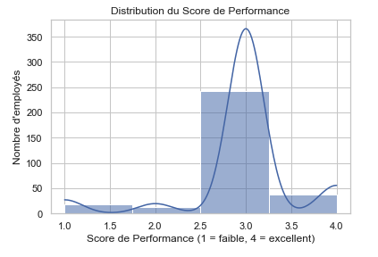
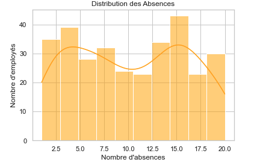
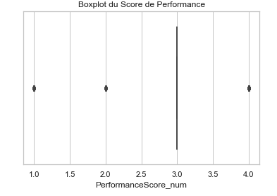
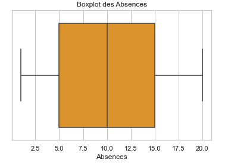
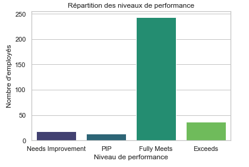

# 📊 Analyse des performances des employés  
*Projet Python – Statistiques, visualisations et détection d’outliers*

## 🎯 Objectif du projet
L’entreprise souhaite comprendre les écarts de performance entre employés et identifier des facteurs pouvant expliquer les comportements atypiques (absences élevées, faibles performances…).

Ce projet analyse :
- Les niveaux de performance  
- La distribution des absences  
- La relation entre absences et performance  
- Les outliers (méthode IQR)

---

# 📁 Données utilisées
Source : `HRDataset_v14.csv`  
Nombre d'observations : **311 employés**

Variables clés :
- `PerformanceScore` → score qualitatif  
- `PerformanceScore_num` → score converti en numérique  
- `Absences` → nombre d'absences  
- `EmpSatisfaction`, `EngagementSurvey` (utilisables pour analyses futures)

---

# 🧮 Méthodes utilisées

### ✔ Statistiques descriptives
- Moyenne, médiane, variance  
- Quartiles  
- Interquartile Range (IQR)  

### ✔ Visualisations exploratoires (Seaborn & Matplotlib)
- Histogrammes  
- Boxplots  
- Diagrammes en barres  

### ✔ Détection des outliers  
- Règle : *Valeur > Q3 + 1.5 × IQR*

---

# 📈 Visualisations principales

## 1️⃣ Distribution du Score de Performance  

---

## 2️⃣ Distribution des Absences  

---

## 3️⃣ Boxplot du Score de Performance  

---

## 4️⃣ Boxplot des Absences  

---

## 5️⃣ Répartition des niveaux de performance  

---

# 🔍 Insights clés

### 🎯 **1. La majorité des employés a un score “Fully Meets”**
→ La performance globale est satisfaisante  
→ Peu de profils en difficulté (“PIP”, “Needs Improvement”)

### 📌 **2. Les absences sont très variables**
- Min : 1  
- Max : 20  
- Médiane : 10  

→ L'entreprise a plusieurs employés avec une présence instable.

### ⚠️ **3. Aucun outlier détecté dans les absences selon la méthode IQR**
Cela signifie :
- Les absences élevées restent “raisonnables” statistiquement  
- Mais elles peuvent être problématiques d’un point de vue RH

### 🔗 **4. Absences ≠ Performance**
Aucun lien direct observé dans l’analyse simple.  
→ Les employés avec beaucoup d’absences ne sont pas forcément les moins performants.

---

# 💡 Recommandations RH

### ✔ 1. Mettre en place un suivi individualisé des absences
Même sans outlier statistique, certains employés dépassent 15 absences.

### ✔ 2. Approfondir les causes des performances faibles
Analyser :
- Le rôle  
- Le département  
- Le manager  
- La satisfaction et l'engagement

### ✔ 3. Construire un modèle prédictif (évolution future possible)
Suggestions :
- Modèle de régression pour prédire la performance  
- Clustering pour segmenter les employés  
- Analyse de corrélation plus complète

---

# 🧠 Compétences démontrées dans ce projet
- Nettoyage & manipulation de données (Pandas)  
- Visualisation avancée (Matplotlib, Seaborn)  
- Analyse statistique descriptive  
- Détection d’outliers (IQR)  
- Interprétation business & recommandations RH  
- Structuration d’un projet Data Analyst GitHub  
